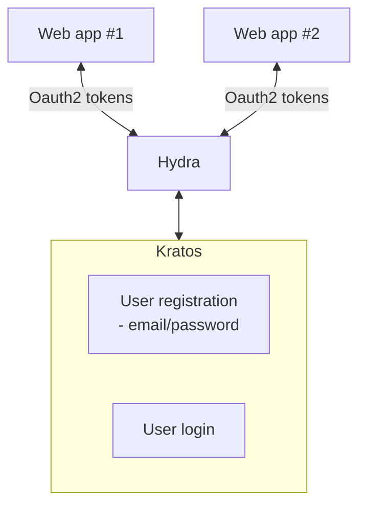

# Ory Kratos & Ory Hydra integration demo

## Goal
Set up a service for user registration and login that can provide Oauth2 tokens. 



This demonstration does not set up email verification or recovery, or any sort of federated login. It is designed to run in local development mode with zero consideration for security.

## Video demo

[](https://youtu.be/F6ZKrxf8LuQ)

## Set up

1. Set up the Docker containers. This will take a few minutes.
```sh
git clone git@github.com:shodgson/ory-kratos-hydra-integration-demo.git
cd ory-kratos-hydra-integration-demo
docker compose -f quickstart.yml up --build
```

2. Create an Oauth2 client via the HTTP API using cURL/Postman/etc, or using the Hydra CLI tool. Record the client ID.
```sh
curl --request POST \
  --url http://127.0.0.1:4445/admin/clients \
  --header 'Content-Type: application/json' \
  --data '{
  "grant_types": [
    "authorization_code",
    "refresh_token"
  ],
  "redirect_uris": [
    "http://127.0.0.1:5555/callback"
  ],
  "response_types": [
    "code",
    "id_token"
  ],
  "scope": "openid offline",
  "token_endpoint_auth_method": "none"
}'
```

3. In a browser, request an authorization code by opening: `http://127.0.0.1:4444/oauth2/auth?client_id=$CLIENT_ID&redirect_uri=http%3A%2F%2F127.0.0.1%3A5555%2Fcallback&response_type=code&state=1102398157&scope=offline%20openid`. Replace `$CLIENT_ID` with the client ID generated in Step 2. After registering and logging in, you will be redirected to the non-existent page `http://127.0.0.1:5555/callback?code=ory_ac...`. Record the code query parameter.

4. Exchange the code for an auth token, replacing $CLIENT_ID and $AUTH_CODE.
```sh
curl --request POST \
  --url http://127.0.0.1:4444/oauth2/token \
  --header 'Content-Type: application/x-www-form-urlencoded' \
  --data client_id=$CLIENT_ID \
  --data code=$AUTH_CODE \
  --data grant_type=authorization_code \
  --data redirect_uri=http://127.0.0.1:5555/callback
```

## Versions

This demo has been tested with the following software versions:

| Software       | Version |
| -------------- | ------- |
| Docker engine | 24.0.5  |
| Docker compose               | 3.7        |
| Ory Kratos     | 1.1.0   |
| Ory Hydra      | 2.2.0   |


## Ports

The following ports are used at http://127.0.0.1:

| Port | Description                         |
| ---- | ----------------------------------- |
| 4433 | Kratos public URL                   |
| 4434 | Kratos admin URL                    |
| 4444 | Hydra public URL                    |
| 4445 | Hydra admin URL                     |
| 4455 | DEMO UI: Kratos sign up, sign in, logout, consent |

## Clean up

After running the demo, clean up Docker by running

```sh
docker compose -f quickstart.yml kill
docker compose -f quickstart.yml rm -f -v
```
